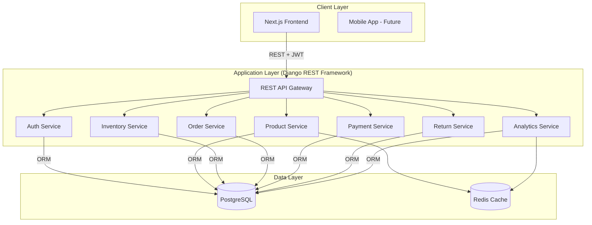
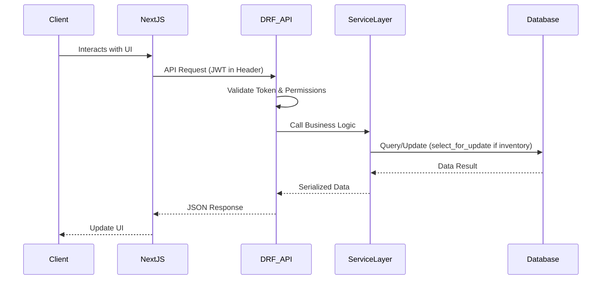

# 🏗 System Architecture

## 🧩 System Architecture Overview

### Architecture Diagram

---

## 💻 Technology Stack

### Frontend
- **Framework:** Next.js (React)
- **Language:** TypeScript
- **State Management:** TanStack Query (React Query)
- **Styling:** Vanilla CSS / Tailwind (Optional)

### Backend
- **Framework:** Django REST Framework (DRF)
- **Language:** Python 3.12+
- **Pattern:** Service Layer Pattern (logic isolated from views)
- **Tools:** Ruff, Mypy, UV

### Database
- **Primary:** PostgreSQL (ACID compliant)
- **Caching:** Redis (Product catalog & session caching)

### Infrastructure
- **Hosting:** Railway
- **Storage:** AWS S3 / Cloudinary (Product images)
- **Payments:** Stripe
- **SMS:** Twilio

---

## 🔧 Service Architecture

### Modular Backend Design

The system follows a "Microservices-inspired" modular monolith structure:

1.  **Authentication Service:** Manages JWT tokens, registration, and RBAC permission checks.
2.  **Product Service:** Handles catalog management, categories, and complex variant logic.
3.  **Inventory Service:** Dedicated to stock tracking, atomic updates, and concurrency control using `select_for_update`.
4.  **Order Service:** Manages the order lifecycle from `Pending Payment` to `Delivered`.
5.  **Payment Service:** Securely integrates with Stripe, processes webhooks, and manages transaction logs.
6.  **Return Service:** Validates return windows and reasons, handles approval workflows.
7.  **Analytics Service:** Aggregates sales data and provides business intelligence metrics.

---

## 📊 Data Flow

### Request-Response Cycle

---

## 🔐 API Architecture

- **Protocol:** HTTP/HTTPS
- **Format:** RESTful JSON API
- **Authentication:** JWT (JSON Web Tokens)
- **Rate Limiting:** IP-based throttles on sensitive endpoints
- **CORS:** Restrictive policy allowing only trusted domains

---

## 📈 Scalability Considerations

1. **Database Integrity:** Strategic indexing on `UUID` and searchable fields.
2. **Concurrency:** Row-level locking for inventory prevents race conditions during high-traffic sales.
3. **Statelessness:** API is fully stateless, allowing horizontal scaling behind a load balancer.

---

## 📋 Summary

| Component | Technology | Purpose |
|-----------|-----------|---------|
| **Frontend** | React + Next.js | User interface, client-side logic |
| **Backend** | Django REST Framework | API, business logic |
| **Database** | PostgreSQL | Data persistence |
| **Caching** | Redis | Performance optimization |
| **Payments** | Stripe | Secure payment processing |

---

**Related Documents:**
- [User Roles & Permissions](./02-USER-ROLES.md)
- [Database Schema](./09-DATABASE.md)
- [System Workflows](./08-WORKFLOWS.md)
