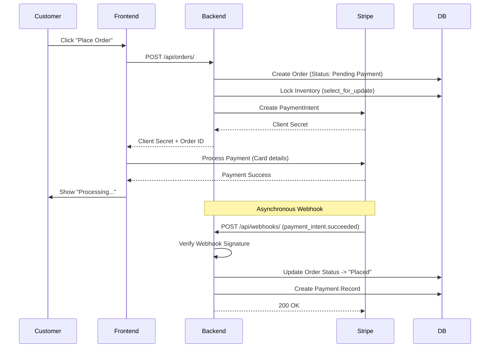
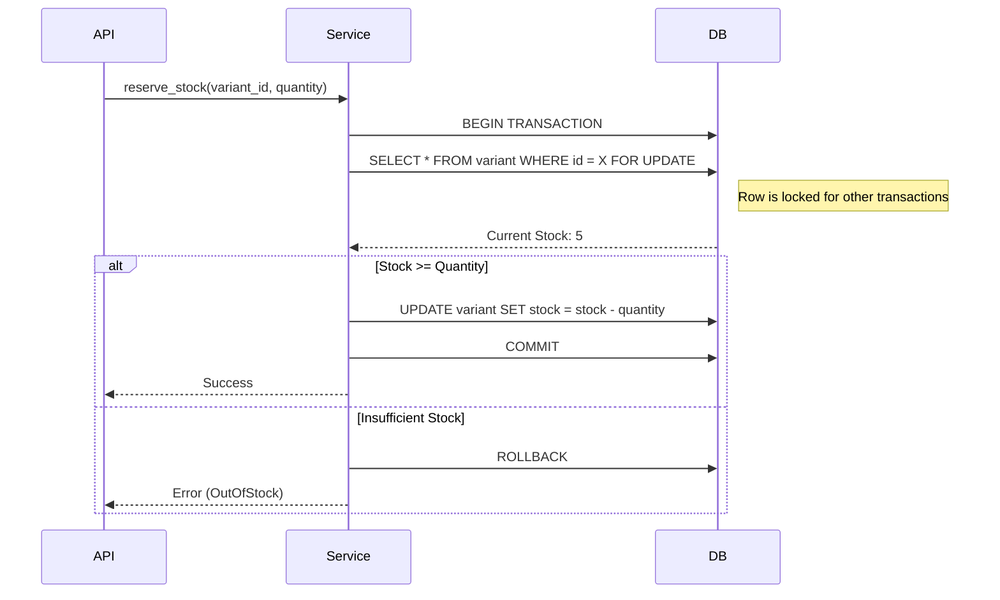
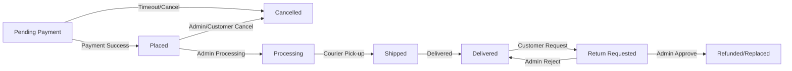
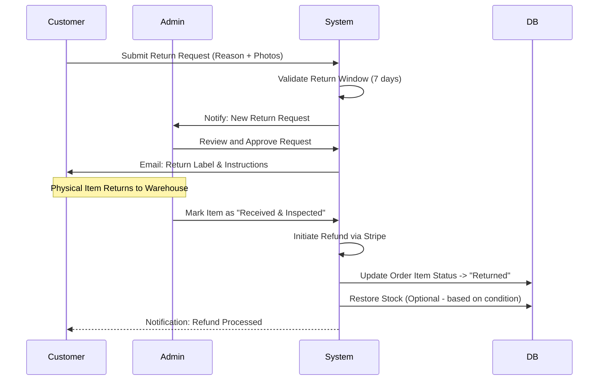

# 🔄 System Workflows

## 🛒 Checkout & Payment Workflow (Stripe Webhook)
This workflow ensures that orders are only activated after verified payment confirmation.

---

## 🔒 Inventory Concurrency Control
Ensures zero overselling by using row-level database locking during checkout.

---

## 📦 Order Lifecycle State Machine
Status transitions are restricted to forward-only movements to maintain data integrity.

---

## 🔁 Return & Refund Workflow
Handles the complexity of physical returns and stock restoration.

---

**Related Documents:**
- [Orders & Checkout](./04-ORDERS-CHECKOUT.md)
- [Payments & Shipping](./05-PAYMENTS-SHIPPING.md)
- [Database Schema](./09-DATABASE.md)
