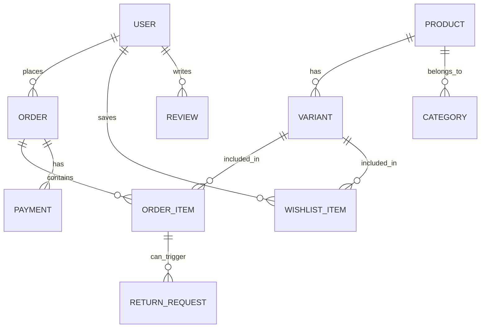

# 🗄 Database Schema

## Entity Relationship Diagram (ERD)

---

## Core Entities

### 1. User & Authentication
| Field | Type | Description |
|-------|------|-------------|
| id | UUID | Primary Key |
| email | String(unique) | User's unique login email |
| role | Enum | `ADMIN`, `STAFF`, `CUSTOMER` |
| permissions | JSONB | Fine-grained staff permissions |

### 2. Product Catalog
**Product:**
| Field | Type | Description |
|-------|------|-------------|
| id | UUID | Primary Key |
| name | String | Searchable product name |
| description | Text | Full product details |
| category_id | UUID | FK to Category |
| base_price | Decimal | Reference price |

**Variant:** (Where stock is actually tracked)
| Field | Type | Description |
|-------|------|-------------|
| id | UUID | Primary Key |
| product_id | UUID | FK to Product |
| sku | String(unique) | Stock Keeping Unit |
| name | String | e.g., "Red / Large" |
| price | Decimal | Specific price for this variant |
| stock | Integer | Real-time available quantity |

### 3. Sales & Orders
**Order:**
| Field | Type | Description |
|-------|------|-------------|
| id | UUID | Primary Key |
| customer_id | UUID | FK to User |
| status | Enum | `PENDING`, `PLACED`, `PROCESSING`, `SHIPPED`, `DELIVERED`, `CANCELLED` |
| total_amount | Decimal | Final price paid (inc. shipping/tax) |
| shipping_address| JSONB | Snapshot of address at time of order |

**Order Item:**
| Field | Type | Description |
|-------|------|-------------|
| id | UUID | Primary Key |
| order_id | UUID | FK to Order |
| variant_id | UUID | FK to Variant |
| quantity | Integer | Units purchased |
| unit_price | Decimal | Price per unit at time of purchase |

### 4. Returns & Refunds
**Return Request:**
| Field | Type | Description |
|-------|------|-------------|
| id | UUID | Primary Key |
| order_item_id | UUID | FK to Order Item |
| reason | Enum | `DAMAGED`, `WRONG_ITEM`, `MISSING`, `OTHER` |
| status | Enum | `PENDING`, `APPROVED`, `REJECTED`, `COMPLETED` |
| refund_amount | Decimal | Amount to be returned to customer |

---

## Data Integrity Rules
1.  **UUIDs:** All primary keys must use UUID v4 to prevent enumeration attacks and simplify distributed IDs.
2.  **Price Storage:** All monetary values must use `Decimal` with 2 decimal places to avoid floating-point errors.
3.  **Soft Deletes:** Products and Variants should use a `is_active` boolean instead of hard deletion to maintain order history.
4.  **Indexes:**
    - `IDX_PRODUCT_NAME` (B-Tree/GIN for search)
    - `IDX_ORDER_CUSTOMER` (B-Tree for history lookups)
    - `IDX_VARIANT_PRODUCT` (B-Tree for catalog rendering)

---

**Related Documents:**
- [Products & Inventory](./03-PRODUCTS-INVENTORY.md)
- [System Architecture](./01-ARCHITECTURE.md)
